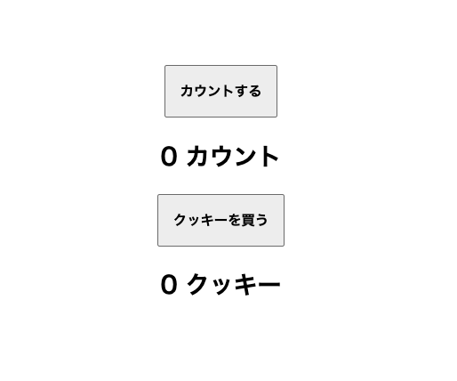
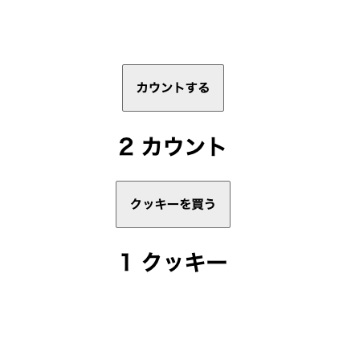

## 以下の条件を満たすコードをJavaScriptで書いてください。

- 画面上に以下の要素があります。
   1. カウンターボタン
   2. 現在のカウント数
   3. 「クッキーを買う」ボタン
   4. 現在のクッキーの枚数
   
- カウンターボタンは押すとカウント数が表示されます。
   - 初期値 ０
   - ボタンを押すたびに１ずつ増加
- 「クッキーを買う」ボタンを押すとクッキーの枚数が１増えます。代わりにカウンターの数字が５減ります。（初期値０）
- カウンターの数字が５より少ない場合はクッキーボタンは押せず、押してもクッキーの数は増えません。
- カウンターの数字が５を超えてもクッキーを買わなかった場合は、そのままカウンターの数字が増えます。

## 宿題
CSS で画面を装飾してきてください。
どんな見た目にしても大丈夫です。完成したら担当のメンターに提出してください。
