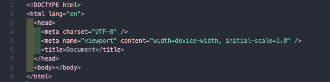
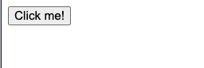
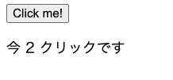
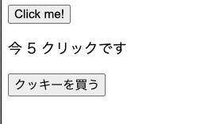
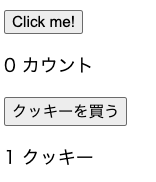
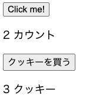
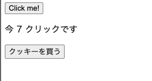
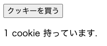
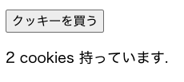

# DOM 操作の問題

## 以下の手順に沿ってコードを書いてください。

（参照用イメージは「手順用イメージ」ディレクトリにあります。）

1. 以下のようにディレクトリ、ファイルを作成してください。
   
2. （以下、作成した「click-counter」ディレクトリ内で作業をしてください。）
3. index.html ファイルに html のテンプレートをショートカットで作成してください。
   
4. 作成した index.html 内に script.js を埋め込んで読み込んでください。
5. 以下のように動作するコードを index.html と script.js を使って記述してください。
   1. 「カウンター」ボタンを作成（ボタンに表示される文字は何でも OK です。）
      
   2. カウンターボタンは押すと押した数が表示されます。（初期起動時はクリック数は表示されていません。）
      
   3. カウンターが５になったら１枚クッキーを買うためのボタンを表示させてください。
      
      カウンターが５より少ない場合はクッキーボタンは押せず、クッキーの数は増えません。
   4. クッキーを買うとカウンターの数字が５減ります。
       
   5. カウンターが５を超えてもクッキーを買わなかった場合は、そのままカウンターの数字が増えます。
      
   6. 「クッキー」は英語で書いてください。１枚なら単数系「cookie」、２枚以上なら「cookies」になるように条件分岐してください。
       

## 宿題

CSS で画面を装飾してきてください。
どんな見た目にしても大丈夫です。完成したら担当のメンターに提出してください。
