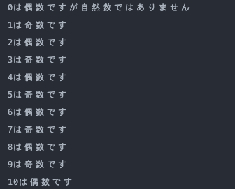

# Python コード問題

## 手順

---

1. 「odd-even.py」ファイルを作成してください。
2. odd-even.py の中で以下を行ってください。
   1. numbers という名前で数値型 ０~１０ の要素を持つリストを作成してください。
   2. リスト内の数字を１つずつ、奇数か偶数かを判定し、数字と結果を「(数字)は(奇数 or 偶数)です」となるように一行ずつ出力してください。ただし、要素が０の場合は「０は偶数ですが自然数ではありません」と出力してください。  
      
